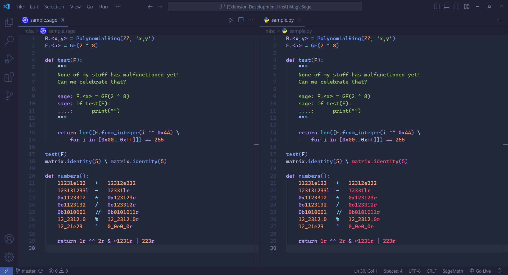

# MagicSage

Want SageMath syntax highlighting? Look no further!

MagicSage adds SageMath support to [MagicPython](https://github.com/MagicStack/MagicPython) ❤️.

> NOTE: MagicSage is an unofficial implementation of MagicPython for SageMath.

Comparison:

Theme: [Tokyo Night Storm](https://github.com/enkia/tokyo-night-vscode-theme)

Differences:
- Raw numbers
- `sage:` and `....:` prompts
- Sage ellipsis
- `^^` as a logical operator
- `^` as an arithmetic operator

For information about Python, see the [original page](https://github.com/MagicStack/MagicPython).

## Problems

Implicit multiplication is currently unsupported.
MagicSage currently does not have extensions set up for VS Code, Atom or Sublime Text.
